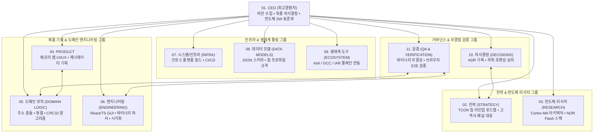

# TLiFlashManager 반도체 플랫폼 조직 체계도 & 11대 부서 R&R

본 문서는 **TLiFlashManager** 프로젝트의 기획, 아키텍처 설계, 반도체 도메인 검증, 구현, 품질 보증을 총괄하는 **11대 부서 조직 체계(Organizational Structure)**를 정의합니다.

---

## 🏛️ 11대 부서 조직 체계 (Organization Chart)

---

## 📋 11대 부서별 핵심 역할 및 책임 (Summary Matrix)

| # | 부서명 | 영문명 | 핵심 역할 (Core Mission) | 주요 산출물 (Key Deliverables) |
|---|---|---|---|---|
| **01** | **CEO** | Chief Executive Officer | 전사 비전, 최종 승인, 반도체 툴 표준화 총괄 | 경영 방침, 전사 로드맵 승인 |
| **02** | **전략** | STRATEGY | TCON 칩 라인업 로드맵 수립 및 패널사 요구사항 분석 | 중장기 제품 로드맵, 고객사 스펙 대응서 |
| **03** | **반도체 리서치** | SEMICONDUCTOR RESEARCH | Cortex-M0 및 SPI Flash 물리적 스펙 분석 | 하드웨어 제약 명세서, Flash 타이밍/용량 분석 |
| **04** | **PRODUCT** | PRODUCT DESIGN | 메모리 맵 비주얼 에디터 기능 명세 및 UI/UX 설계 | PRD, 와이어프레임, 인터페이스 명세서 |
| **05** | **도메인 로직** | DOMAIN LOGIC | 주소 충돌 감지, 섹터 정렬, CRC32, 바이너리 슬라이싱 수식화 | 알고리즘 명세서, 무결성 검증 수학 공식 |
| **06** | **엔지니어링** | ENGINEERING | React/TypeScript 고밀도 UI 및 클라이언트 사이드 엔진 구현 | 프로덕션 빌드, 바이너리 처리 엔진, C 제너레이터 |
| **07** | **시스템/인프라** | PERFORMANCE & INFRA | 자동화된 테스트 러너 및 크로스 플랫폼 데스크톱 패키징 | CI/CD 파이프라인, 성능 프로파일링 리포트 |
| **08** | **데이터 모델** | DATA MODELS | FlashSegment, FlashMemoryMap, 칩 프로파일 스키마 관리 | JSON/TypeScript 스키마 정의, 프로파일 프리셋 |
| **09** | **생태계 도구** | ECOSYSTEM TOOLING | Keil MDK, GNU GCC, IAR 린커 문법 완벽 호환 보장 | Linker Script 템플릿, C Header 템플릿 |
| **10** | **의사결정** | DECISIONS (ADR) | 아키텍처 결정 기록(ADR) 및 하위 호환성 거버넌스 | ADR 문서, 스키마 변경 심의록 |
| **11** | **검증** | QA & VERIFICATION | 실제 브라우저 E2E 검증 및 비트 레벨 바이너리 무결성 보증 | 전수 검증 리포트, 결함 대장, 회귀 테스트 스위트 |
